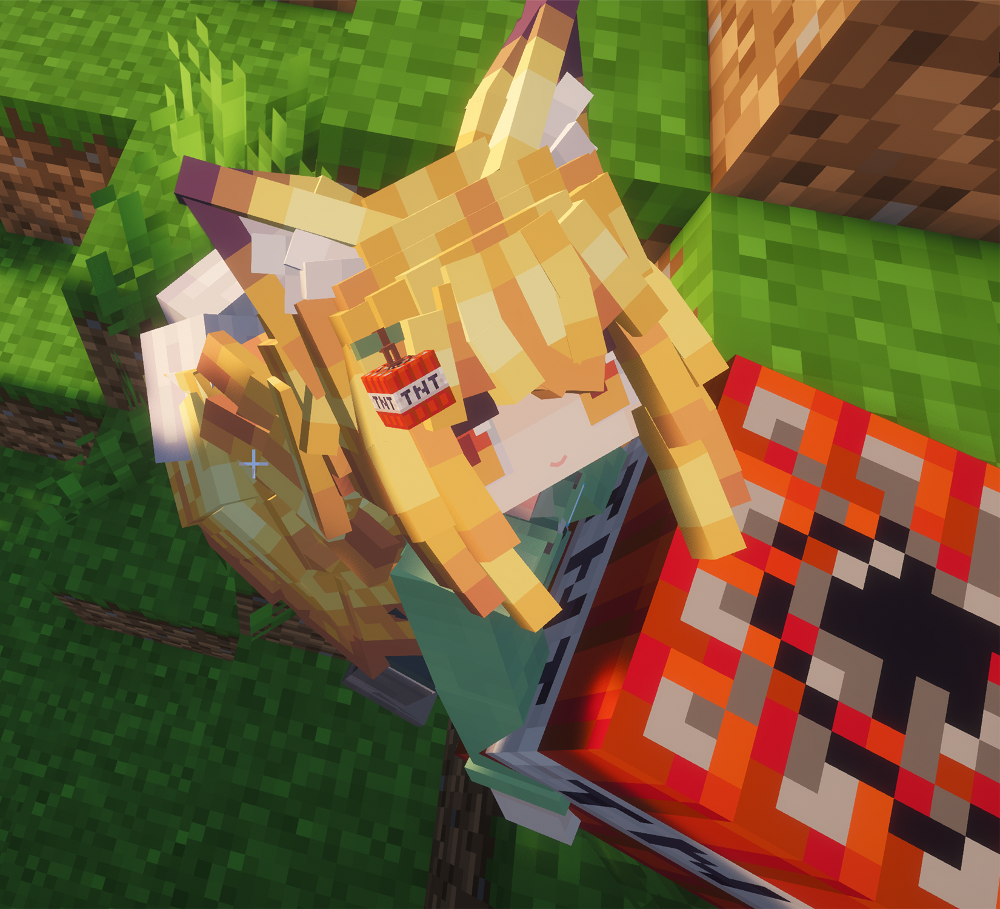
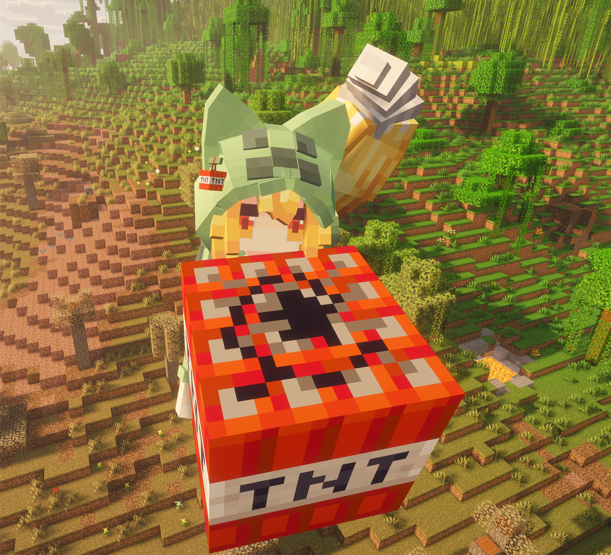
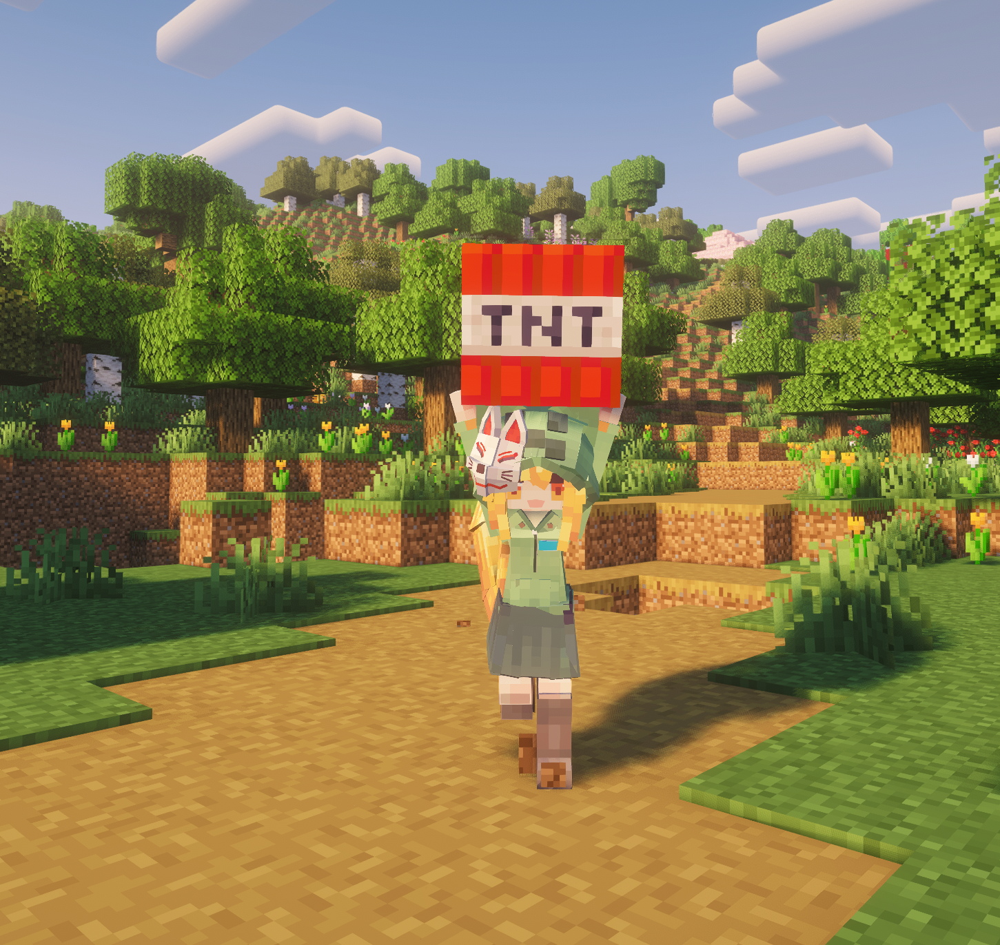

# CreeperWineFox · 苦力怕酒狐

用于 Minecraft [Yes Steve Model（YSM）](https://modrinth.com/mod/yes-steve-model) 的苦力怕酒狐模型。金发、狐耳、大尾巴，配上苦力怕主题兜帽，带有变身、舞蹈、抱 TNT 等动作与互动。本仓库提供模型文件、下载与后续更新。

## 实机预览

<table>
  <tr>
    <th width="50%">脱帽 · TNT 小挂件</th>
    <th width="50%">戴帽 · 抱 TNT</th>
  </tr>
  <tr>
    <td width="50%" valign="top"></td>
    <td width="50%" valign="top"></td>
  </tr>
</table>

<p align="center">
  <strong>原面具 · 举起 TNT</strong><br>
  
</p>

## 角色介绍

苦力怕酒狐胆小又敏感，被许多人注视时容易压力过大，忍不住「BOOM！」，因此远离城市与人群。后来，她遇到了能够包容自己的小恶魔酒狐，两人成了知心朋友。

以上设定来自原作者提供的角色介绍。

## 模型特色

### 外观与服装

- 苦力怕主题兜帽搭配金发、狐耳和大尾巴，可在服装配置中切换戴帽与脱帽。
- 保留原有面具，并提供 **原面具 / TNT 小挂件 / 不显示** 三档选择。
- TNT 挂件分别适配戴帽、脱帽状态，使用独立挂点与角度；四个侧面均有 TNT 字样。

### 动作与互动

- **日常动作**：待机、走路、奔跑、跳跃、潜行、游泳、攀爬、飞行、鞘翅飞行、坐下与睡觉等动画。
- **动作轮盘**：变身、打招呼、鼓掌、Get Down、乱舞、卖萌、御币摇、舞蹈，以及「中秋快乐」月饼动作。
- **抱方块**：符合模型持物条件时，主手或副手使用抱方块姿势，包含抱 TNT 的表现。
- **TNT 特殊互动**：主手持 TNT、副手持打火石时触发专用动画；保持这组持物并奔跑或跳跃时，会出现星星眼。

### 随附资源与适配

模型还附有箭、三叉戟的外观资源，以及马、骡、矿车和船的载具外观配置；同时包含 Carry On 搬运、女仆互动及枪械动作资源。相关表现依赖对应模组与运行环境，未对所有组合完成实测。

## 原作与署名

原作视频：[【苦力怕酒狐】,什么叫你家酒狐会艺术就是爆炸？](https://www.bilibili.com/video/BV1h6h16hEX8/)

视频由以下三位创作者联合投稿，分工按原视频标注：

| 创作者 | 原视频标注 |
| --- | --- |
| [国家一级保护废物セ](https://space.bilibili.com/471347935) | UP 主 |
| [再来几斤小莫莫](https://space.bilibili.com/3493267685509797) | 动作 |
| [-夜星-](https://space.bilibili.com/394471468) | 模型 |

感谢三位创作者，作品介绍见原视频简介。

本仓库模型基于上述创作者的原作品进行修改与完善，已获原作者同意在 GitHub 发布，下载链接将由作者收录。原作署名及许可声明予以保留。本仓库维护者负责 TNT 挂件、服装配置、部分动画调整及后续维护，具体改动见下方「近期更新」。

## 近期更新

- **装饰三档切换**：原面具 / TNT 小挂件 / 不显示，默认保留原面具。
- **分别适配戴帽与脱帽**：两种状态使用独立的挂点、位置与角度。
- **TNT 贴图调整**：四个侧面均显示 TNT 字样，顶部、底部使用对应贴图。
- **飞行裙摆调整**：飞行时使用跟随胯部的裙摆结构。
- **抱物移动调整**：抱方块走动时减少躯干与裙摆的动画覆盖，抱物跑跳的腰腿、裙摆与空手动作对齐。

按原作者要求，保留并行动画 7 及其关联控制逻辑；原有 TNT 特殊效果与星星眼动画未修改。

## 安装

正式版下载：[CreeperWineFox v1.0.0](https://github.com/fatekingsama/CreeperWineFox/releases/tag/v1.0.0)。下载附件 `CreeperWineFox-v1.0.0.zip`，解压后将整个 `CreeperWineFox` 文件夹放入当前游戏实例的 `config/yes_steve_model/custom/`，再重载并选择模型。

如从仓库源码手动安装：

1. 安装适合游戏版本的 YSM。
2. 在当前游戏实例的 `config/yes_steve_model/custom/` 下创建 `CreeperWineFox` 文件夹。
3. 将本仓库的 `ysm.json` 和以下资源文件夹放入其中：

   ```text
   config/yes_steve_model/custom/CreeperWineFox/
   ├── ysm.json
   ├── animations/
   ├── avatar/
   ├── controller/
   ├── functions/
   ├── lang/
   ├── models/
   ├── sounds/
   └── textures/
   ```

4. 在游戏中执行 `/ysm model reload`，然后在 YSM 模型选择界面选择「苦力怕酒狐」。命令需要相应权限。

更新已有安装前，建议备份旧模型。`README.md`、`docs/`、`design/`、Git 文件及本地备份无需复制到游戏目录。

## 使用

在 YSM 动作轮盘中打开 **服装配置**：

- **是否脱帽**：切换兜帽状态。
- **面具 / 挂件**：选择原面具、TNT 小挂件或不显示。

切换帽子不会清除挂件选择。模型选择与动作轮盘的按键可在游戏「选项 → 控制 → 按键绑定」中查看或设置。

变身、打招呼、舞蹈等动作可直接在动作轮盘中选择。体验 TNT 特殊互动时，将 **TNT 放在主手、打火石放在副手**，再尝试奔跑或跳跃。

## 当前状态与反馈

当前版本已完成游戏内自测，暂未发现明显问题。如使用中遇到异常，欢迎反馈。

反馈时请说明游戏与 YSM 版本、遇到的问题及复现步骤，并尽可能附上截图或短视频，方便定位和处理。

## 许可与资源说明

原模型在 `ysm.json` 中声明使用 **[CC BY-NC-SA 4.0](https://creativecommons.org/licenses/by-nc-sa/4.0/deed.zh-hans)**，本仓库对模型的修改沿用该声明。转载或分发时请保留原作者署名、原作链接及修改说明，并遵守该许可。

随原模型提供的音乐、动作参考等来源说明保留在 `ysm.json`；第三方素材的权利归其各自权利人所有。

`design/戴帽与脱帽挂饰设计.png` 为 AI 生成的设计参考，并非游戏实机截图。
